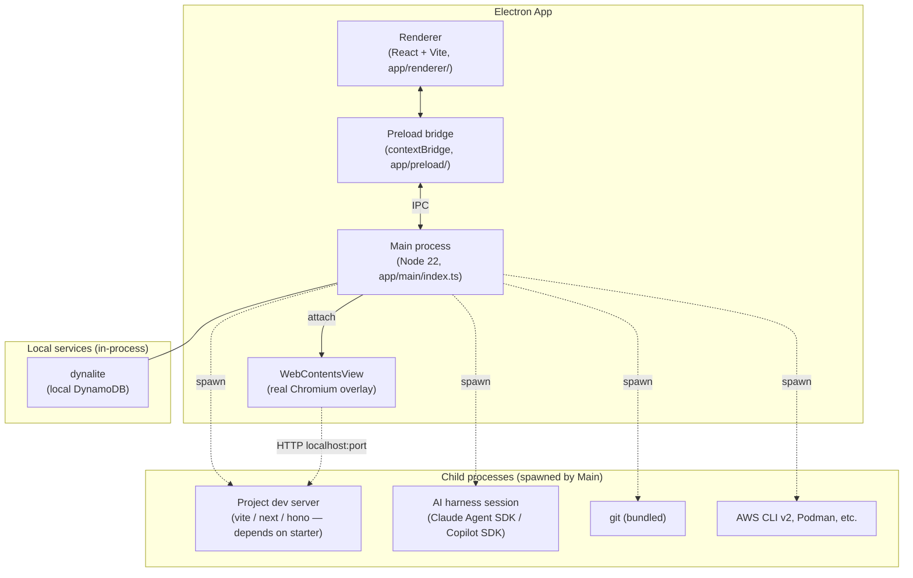
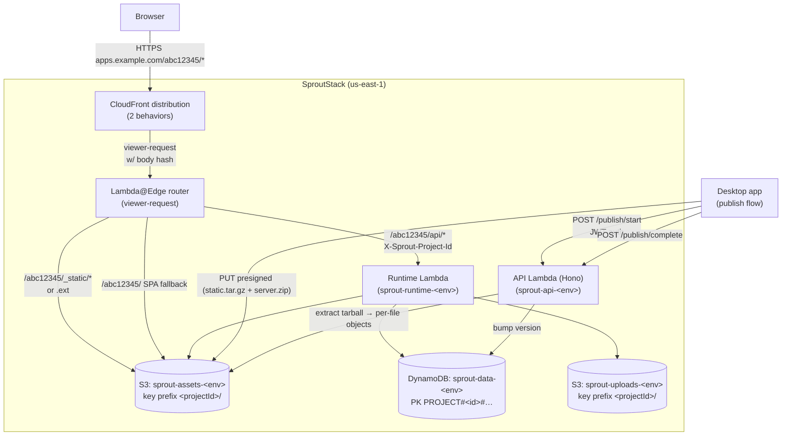
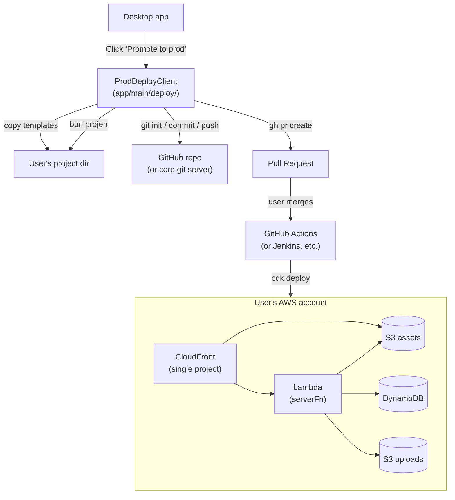
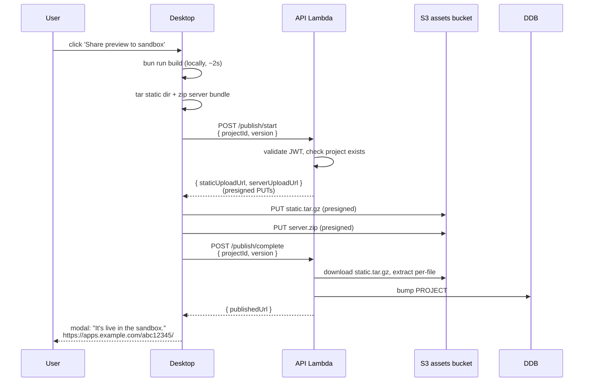
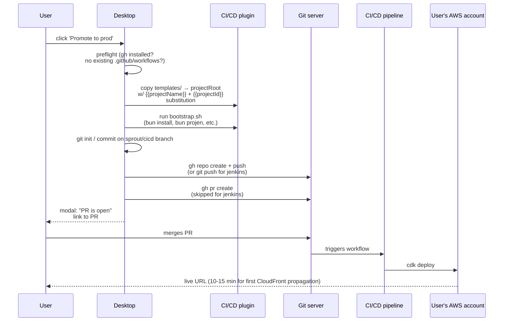
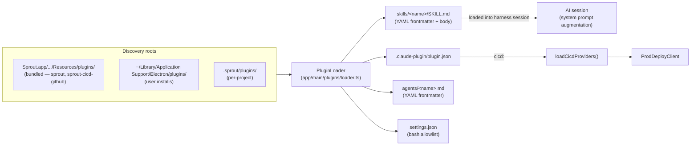

# Architecture

How Sprout fits together end-to-end. Written for someone joining the project who's read [USER_GUIDE.md](./USER_GUIDE.md) and now needs to know where the code lives and why.

There are three runtime planes:

1. **Desktop** — the Mac app the user installs. Electron main + renderer, plus a swarm of subprocesses (dev servers, the AI harness, bundled CLIs).
2. **Sandbox runtime** — Sprout's hosted AWS infra. Multi-tenant: every project shares one CloudFront + one Lambda + one DDB table, isolated by path prefix + key prefix.
3. **Standalone prod runtime** — a user's own AWS account, scaffolded by "Promote to prod" into their own GitHub repo. Single-tenant.

The whole product is designed so the same AI-generated app code runs unchanged in #2 and #3.

---

## Process model (desktop)



**Key invariants:**

- The renderer **never** has Node access. Everything that touches the filesystem, network, or child processes goes through typed IPC (`app/main/ipc.ts`).
- The preview pane is a real `WebContentsView` — a separate web contents painted over the right side of the window. It loads the project's dev server URL directly (`http://localhost:<port>`), so live-reload and Vite HMR work natively.
- Bundled binaries live in `Sprout.app/Contents/Resources/bin/{arm64|x64}/`. `app/main/path-shim.ts` runs *before* any `child_process` import and prepends this directory to `PATH`, so spawned processes find the bundled Node, git, AWS CLI, etc.
- Dynalite runs in-process (a tiny mock DynamoDB server) and is reachable at `process.env.SPROUT_DYNALITE_ENDPOINT`. Project subprocesses pick it up via env-var injection, so `new DynamoDBClient({})` in user code transparently hits dynalite locally and real DDB when published.

### Main process modules

```
app/main/
├── index.ts            ← Electron entrypoint. Runs path-shim FIRST.
├── ipc.ts              ← Typed IPC channel registry (~30 channels)
├── services.ts         ← Service container; owns project lifecycle
├── path-shim.ts        ← PATH injection for bundled binaries
│
├── auth/               ← Auth0 Native PKCE flow + safeStorage cache
├── cloud/              ← Hono client wrapper for the deployed API
├── deploy/             ← "Promote to prod" orchestrator (ProdDeployClient)
├── dynalite/           ← Embedded local DynamoDB server
├── harness/            ← AI harness adapters (Claude, Copilot, mock)
├── onboarding/         ← First-run state machine (~/Library/.../state.json)
├── plugins/            ← Plugin discovery + frontmatter parsing
├── projects/           ← ProjectManager, Worktree, DevServer
└── publish/            ← "Share preview to sandbox" client
```

The split is intentional:

- `services.ts` is the only module the renderer-facing IPC layer talks to. Everything else is a service it composes.
- Each subdirectory is independently testable. `tests/` mirrors this layout one-to-one (e.g. `tests/worktree-restore.test.ts`, `tests/copilot-adapter.test.ts`).

---

## AI harness pattern

The AI agent that scaffolds and edits code lives behind a stable `HarnessAdapter` interface. Anything that drives the AI talks to the interface, not the underlying SDK.

```mermaid
flowchart LR
  Chat["ChatPane.tsx"] -->|IPC: chat:send| Services["services.ts"]
  Services --> Registry["HarnessRegistry"]
  Registry -->|defaultAdapterId| Detect{"What's installed?"}
  Detect -->|@anthropic-ai/claude-agent-sdk + key| ClaudeA["ClaudeAdapter"]
  Detect -->|@github/copilot-sdk + copilot CLI| CopilotA["CopilotAdapter"]
  Detect -->|nothing| MockA["MockAdapter"]

  ClaudeA --> CSession["ClaudeSession<br/>(claude-agent-sdk)"]
  CopilotA --> CopSession["CopilotSession<br/>(copilot-sdk → CLI binary)"]

  CSession -->|HarnessEvent stream| Services
  CopSession -->|HarnessEvent stream| Services
  Services -->|IPC: chat:event| Chat
```

The contract is `app/main/harness/types.ts`:

```ts
interface HarnessAdapter {
  startSession(opts: SessionOpts): Promise<HarnessSession>;
}
interface HarnessSession {
  send(message: string): AsyncIterable<HarnessEvent>;
  approvePermission(id, decision): void;
  interrupt(): void;
  dispose(): Promise<void>;
}
type HarnessEvent =
  | { type: 'text'; delta: string }
  | { type: 'tool_use'; id, name, input }
  | { type: 'tool_result'; id, output, isError? }
  | { type: 'permission_request'; id, tool, input }
  | { type: 'turn_done' }
  | { type: 'error'; error };
```

Every adapter normalizes its SDK's events into this shape. The renderer renders the same way regardless of which AI is behind the curtain — that's why Copilot tool calls (`str_replace_editor`, `bash`) and Claude tool calls (`Edit`, `Bash`) both show up as the same friendly action cards. See `inferActionCard()` in `app/renderer/chat/ChatPane.tsx` for the tool-name normalization.

Adapters live in `app/main/harness/`:

| File | Adapter | When picked |
|---|---|---|
| `claude-adapter.ts` | Claude (via `@anthropic-ai/claude-agent-sdk`) | `~/.claude` exists OR `ANTHROPIC_API_KEY` set |
| `copilot-adapter.ts` | Copilot (via `@github/copilot-sdk`, wraps `copilot` CLI) | `copilot` binary on PATH |
| `mock-adapter.ts` | Canned responses | Always available; default for the "Demo" choice |

The registry's `defaultAdapterId()` runs these probes once per app launch.

---

## Sandbox runtime (multi-tenant)

The "Share preview to sandbox" path. One shared `SproutStack` deployment hosts every user's apps.



**How a request routes:**

1. User hits `https://apps.example.com/abc12345/foo` in a browser.
2. CloudFront receives. Lambda@Edge (`runtime/edge-router.ts`) inspects the path:
   - First segment `abc12345` → project ID. Validate (Crockford base32 or UUID).
   - Look up `PROJECT#abc12345` in DDB (Lambda@Edge can't reach DDB directly, so this is a cached header check the desktop publishes).
3. Three-way routing:
   - **Extension-based static** (`*.js`, `*.css`, `*.png`, etc.): rewrite origin to S3, key = `<projectId>/<rest>`. CloudFront serves from `sprout-assets-<env>`.
   - **`/api/*` (or `*/api/*`)**: forward to runtime Lambda with `X-Sprout-Project-Id: abc12345` header injected. CloudFront signs the request with SigV4; edge router pre-computes the body SHA256 and adds `x-amz-content-sha256` so Function URL SigV4 verification passes for POST bodies.
   - **SPA fallback** (everything else): serve `<projectId>/index.html` from S3. The SPA itself routes client-side.
4. The runtime Lambda (`runtime/handler.ts`) sees the path, sets `process.env.SPROUT_PROJECT_ID` + the four other `SPROUT_*` vars, lazy-loads the project's `server.js` from S3 the first time, then invokes its handler.
5. The project's handler runs ordinary AWS SDK calls — `new DynamoDBClient({}).send(new GetItemCommand({ TableName: process.env.SPROUT_DATA_TABLE, ... }))`. The shared DDB table is namespaced by `PROJECT#<id>#…` key prefix.

**Why path-prefix routing not subdomains:** corp environments often block wildcard ACM certs. One cert for `apps.sprout.<env>` covers every project; we never need to ask for a new cert per user.

**Tenant isolation:** convention-based, not IAM-blocked. Every AI-generated query *must* prefix DDB keys with `PROJECT#${SPROUT_PROJECT_ID}#`. If the AI forgets the prefix, project A could read project B's data. The starter template scaffolds canonical patterns; the system prompt explains the rule. This is acceptable for an internal/trusted audience; for external SaaS you'd want a scoped DynamoDB client wrapper (`makeScopedDDB(projectId)`) that does it for you.

### Files

```
runtime/
├── edge-router.ts      ← Lambda@Edge (must be in us-east-1)
├── handler.ts          ← Shared runtime Lambda
└── placeholder/        ← Stub bundle uploaded on project create

lambda/api/
├── index.ts            ← Hono app, exported via hono/aws-lambda
└── routes/
    ├── projects.ts     ← POST/GET /projects, project metadata
    ├── publish.ts      ← /publish/start (presign), /publish/complete (extract tarball)
    ├── share.ts        ← /share (mint code), /share/:code/open (resolve)
    └── chat.ts         ← chat history sync (push-only from desktop)

infra/
├── bin/app.ts          ← single SproutStack instantiation
└── lib/sprout-stack.ts ← VPC, DDB, S3 (assets+uploads+code), CloudFront, runtime Lambda, API
```

---

## Standalone prod runtime

"Promote to prod" forks the user's project into a fresh GitHub repo (or whatever git server the active CI/CD plugin targets) with a CDK pipeline. After the user merges the PR, every push to main deploys to *their* AWS account.



The user's standalone runtime Lambda gets **the same `SPROUT_*` env vars** as the sandbox runtime sets:

| Env var | Sandbox value | Standalone value |
|---|---|---|
| `SPROUT_MODE` | `'sandbox'` | `'prod'` |
| `SPROUT_PROJECT_ID` | per-request from edge router header | mustache-baked at scaffold time |
| `SPROUT_DATA_TABLE` | the shared sandbox table | the standalone stack's own table |
| `SPROUT_ASSETS_BUCKET` | the shared sandbox bucket | the standalone stack's own bucket |
| `SPROUT_UPLOADS_BUCKET` | the shared sandbox bucket | the standalone stack's own bucket |

That's the load-bearing compatibility shim: AI-generated code that reads `process.env.SPROUT_PROJECT_ID` and prefixes DDB keys with `PROJECT#${...}#…` works **identically** in both modes. The only thing that changes is which physical resources the env vars point at.

`SPROUT_MODE` is the escape hatch when code genuinely needs to branch (e.g., "in prod, send email via SES; in sandbox, log to console"). The SKILL.md scaffolds a switch-with-exhaustiveness-check pattern.

### CI/CD plugin contract

`ProdDeployClient` doesn't know about GitHub or Jenkins specifically. It picks the active CI/CD plugin and runs its templates + bootstrap script. See [CUSTOM_INSTALL.md](./CUSTOM_INSTALL.md) for the contract.

```
plugins/
├── sprout/                      ← bundled starter (sprout:new-app skill)
├── sprout-cicd-github/          ← bundled GitHub Actions deploy provider
└── sprout-cicd-jenkins-example/ ← reference shape only (not loaded at runtime)
```

A plugin with a `cicd:` manifest block is a deploy provider. `loadCicdProviders()` filters for them; `resolveActiveCicdProvider()` picks one via env var / config file / count.

---

## User flow: from prompt to live preview

The most-trodden path in the app: a user types something, an AI agent does work, the preview reloads.

```mermaid
sequenceDiagram
  participant U as User
  participant R as Renderer
  participant M as Main
  participant H as Harness
  participant FS as Project files
  participant DS as Dev server
  participant P as Preview pane

  U->>R: types "build a habit tracker"<br/>+ presses ⌘↵
  R->>M: ipc 'chat:send'
  M->>H: session.send(message)
  H-->>M: event: text "I'll create the components…"
  M-->>R: ipc 'chat:event'
  R-->>U: streams text into chat bubble
  H-->>M: event: tool_use { name: 'Edit', file: 'src/App.tsx' }
  M-->>R: ipc 'chat:event'
  R-->>U: renders action card "Editing App.tsx"
  H->>FS: applies edit (via tool)
  H-->>M: event: tool_result { ok }
  H-->>M: event: turn_done
  M->>M: Worktree.checkpoint()<br/>(git add -A; git commit -m "checkpoint: …")
  M->>DS: ensureRunning(projectRoot)
  DS-->>M: 'listening on http://localhost:5174'
  M->>P: attachPreview(url)
  M-->>R: ipc 'preview:url'
  R-->>U: preview pane loads the new app
```

**Retry behavior:** if the dev server hasn't bound a port within ~12s of `turn_done`, `retryStartPreview()` fires another attempt with backoff `[2500, 3500, 5000, 8000, 12000]`. This catches the case where the AI wrote files but the dev script wasn't running yet, and the case where Vite is mid-restart on file change.

**Checkpoint commits:** every successful turn produces a git commit on the project's local repo. The bottom save-point strip in the preview pane is a UI over these commits. Restoring is **non-destructive** — `Worktree.restore()` first snapshots whatever's in the working tree (so unsaved AI work isn't lost), then `git read-tree --reset -u <target-hash>` replaces the tree (deleting orphans), then a new "rolled back to: …" commit lands on top. Every prior save point remains reachable from the timeline.

---

## User flow: "Share preview to sandbox"



The runtime Lambda doesn't get a deploy notification — it picks up the new code on its next cache miss. To force immediate refresh, the loader checks the DDB version on each request and evicts when it changes (~200ms penalty for the next user).

---

## User flow: "Promote to prod"



---

## Plugin system



The plugin format is compatible with **Claude Code skills** and **GitHub Agent Skills** — both use frontmatter-prefixed markdown in `skills/<name>/SKILL.md`. One parser handles both.

A plugin can declare any combination of:

- **`skills/`** — markdown files the AI reads as context. Used for starters (`sprout:new-app` scaffolds a Vite + React + Hono project), how-to references, etc.
- **`agents/`** — long-form AI prompts the user can invoke by name (Copilot terminology; Claude calls them subagents).
- **`cicd:`** in `plugin.json` — declares the plugin is a deploy provider. See [CUSTOM_INSTALL.md](./CUSTOM_INSTALL.md).
- **`settings.json`** — bash allowlist + permission rules consumed at session start.

`CLAUDE_PLUGIN_ROOT` and `SPROUT_PLUGIN_ROOT` env vars are set when invoking scripts from a skill, so `${CLAUDE_PLUGIN_ROOT}/scripts/foo.sh` resolves correctly regardless of where the plugin was installed.

---

## State + persistence

### On disk (per user)

| Path | What |
|---|---|
| `~/Library/Application Support/Electron/state.json` | Onboarding state, current project pointer, projects-root path |
| `~/Library/Application Support/Electron/plugins/` | User-installed plugins (CI/CD providers, custom skills) |
| `~/Library/Application Support/Electron/sprout-ddb/` | Embedded dynalite's data files (local DynamoDB) |
| `~/.sprout/config.json` | Active CI/CD provider (when more than one installed) |
| `~/sprout-projects/<slug>/` | Per-project git repo + scaffolded files. User-relocatable. |

### In the cloud (per user, when signed in)

| Place | What |
|---|---|
| Auth0 native client | Identity (sub + email) |
| Sprout API + DDB | Project list, share codes (project codes), publish state, chat history (push-only) |
| Sprout assets/uploads buckets | Per-project static + uploaded files (key-prefixed by projectId) |

The desktop is the source of truth for project files. The cloud sync is metadata-only — the chat history is one-way (desktop pushes, cloud archives) and project files round-trip via the share-code flow (zip the worktree on share; clone on join).

---

## Why three deploy planes (instead of two)?

You might wonder why both a Sandbox runtime *and* a Standalone prod runtime — couldn't the user just promote straight from local to prod, skipping sandbox?

The case for keeping all three:

- **Local** is for iteration. No deploy step. Subsecond feedback. AI does all its work here.
- **Sandbox** is for sharing without commitment. Tell a teammate "look at this" without provisioning AWS, owning a domain, or signing terms-of-service. It's also the *only* runtime that supports the share-code "open my project in your Sprout" flow, since the project source needs to round-trip through trusted infra to land on the collaborator's machine.
- **Prod** is for ownership. The user controls the AWS account, the domain, the CI/CD pipeline. Sprout walks away after opening the PR.

The same AI-generated code runs in all three (modulo the `SPROUT_MODE` switch when code genuinely needs to branch). That's the load-bearing property — pick the plane that fits the moment, the code doesn't change.

---

## Cross-references

- **AI agent contract + system prompt walkthrough**: [AGENTS.md](../AGENTS.md)
- **Packaging the desktop app**: [PACKAGING.md](./PACKAGING.md)
- **Running with a non-default deploy stack**: [CUSTOM_INSTALL.md](./CUSTOM_INSTALL.md)
- **Plugin contract details**: [CUSTOM_INSTALL.md § The CI/CD plugin contract](./CUSTOM_INSTALL.md#the-cicd-plugin-contract)
- **Auth0 deep-dive**: [runbooks/auth0-e2e.md](./runbooks/auth0-e2e.md)
- **Jenkins variant**: [runbooks/cicd-jenkins.md](./runbooks/cicd-jenkins.md)
- **GitHub flow runbook**: [runbooks/cicd-github.md](./runbooks/cicd-github.md)
